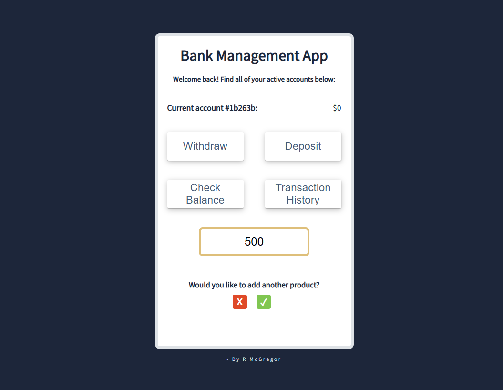

I wanted to make a small functioning app with the logic I used to pass a challenge around monetary values.

The app is basic but has all of the features you would need to check balances, see transaction history, deposit and withdraw etc.

I will eventually add the ability to sign-in/sign-up (which would require back-end C# or just have the details stored locally in an array for this project) add more products, filter between which accounts you want to move money to/from and possilby even remove accounts etc.

To see a working example of this app/project, please use the CodePen link below:

https://codepen.io/BobbyArmac/full/gbPEqXE 
