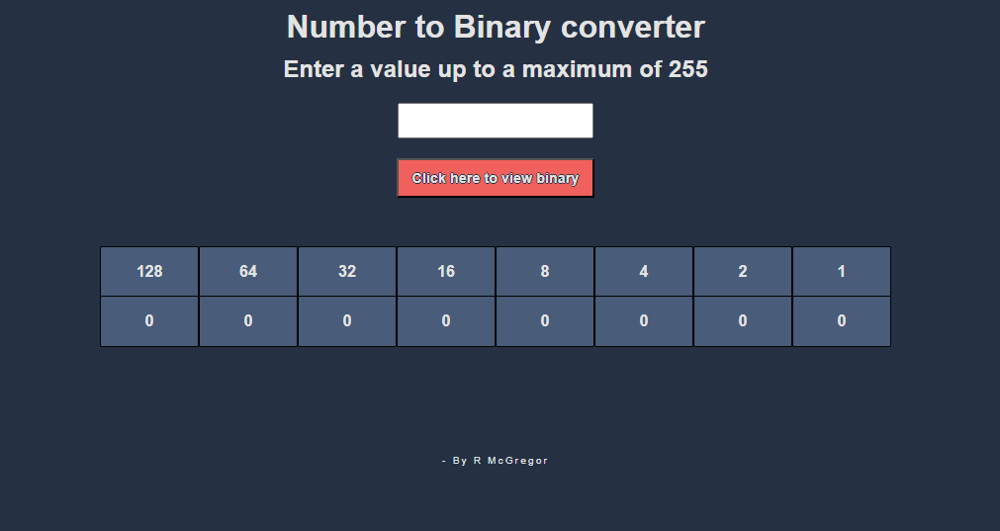

A simple number to binary converter for numeric values up to 255

I was doing some work on a C# learning module and they presented a number to binary converter example and so i wanted to see if i could make one in a short amount of time.
The following code could probably be optimised greatly but this only took me about 10 minutes to do which im happy with.
I might come back to this and see if i can clean the logic up at a later date.
For a working example of this converter please use the link below:

https://codepen.io/BobbyArmac/full/ZYbXXqX
