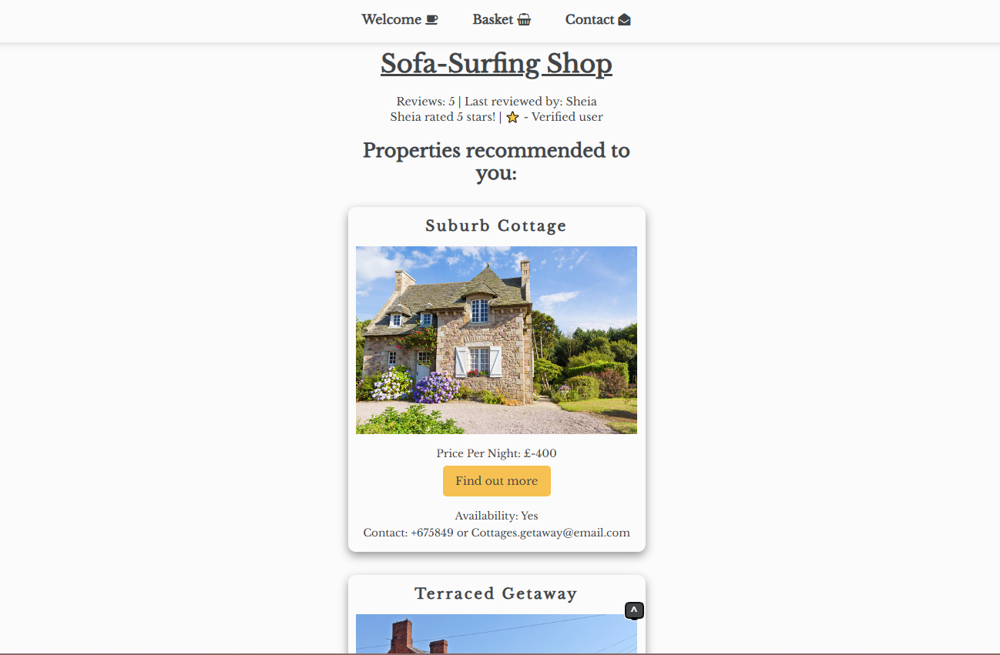

Sofa-Surf-App - work in progress (typescript learning app)

I wanted to work on a small webpage project that utilised the features of Typescript heavily and Scrimba gave me the tools to do so.
I am going to be updating this project frequently until i am happy with the final result.

Please use the CodePen link below to see a working version of this project:

https://codepen.io/BobbyArmac/full/RNrLOjd 
